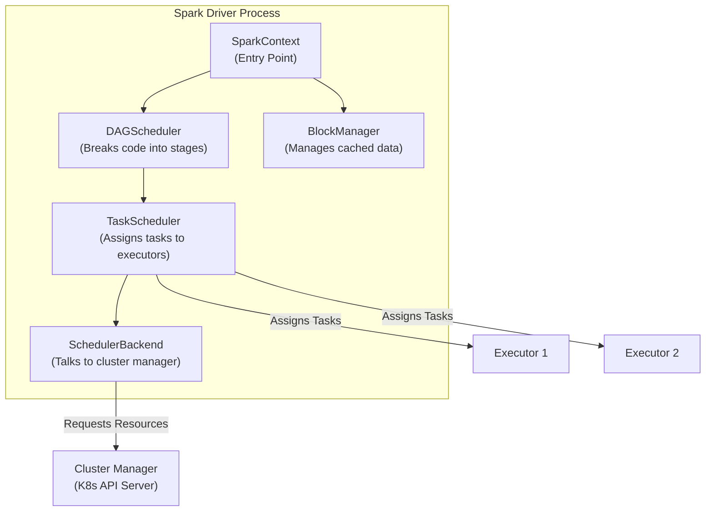
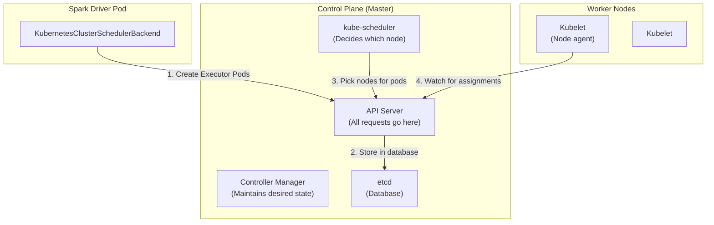
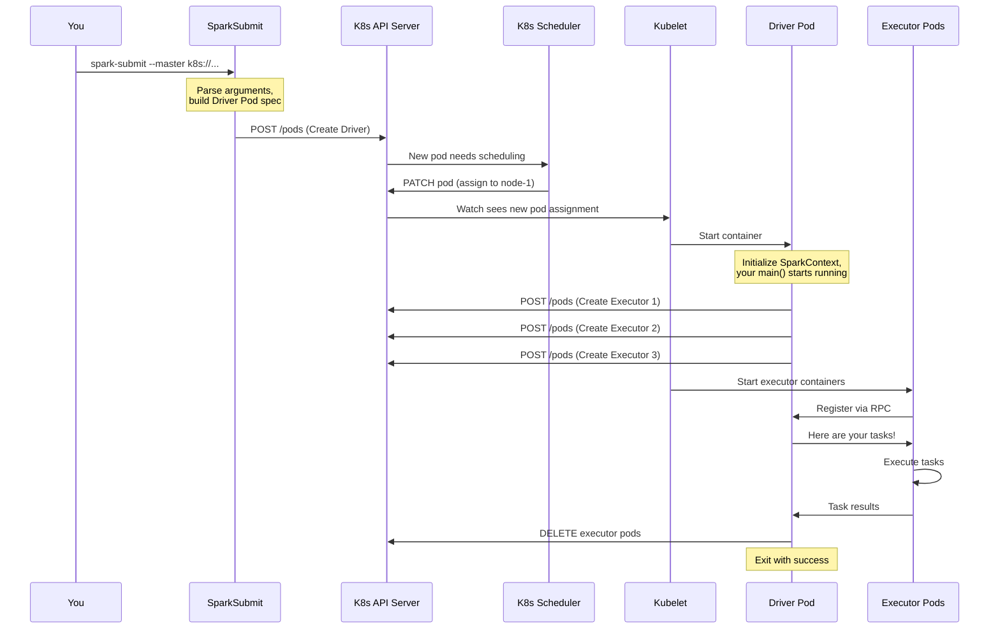
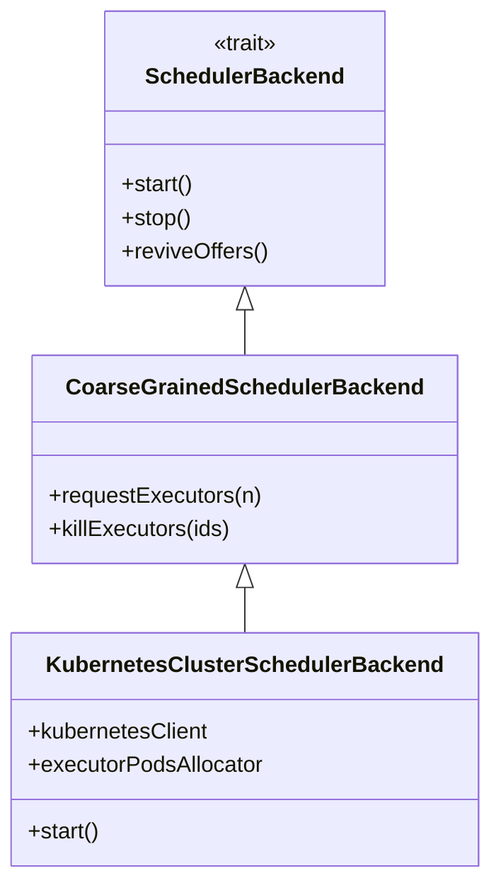
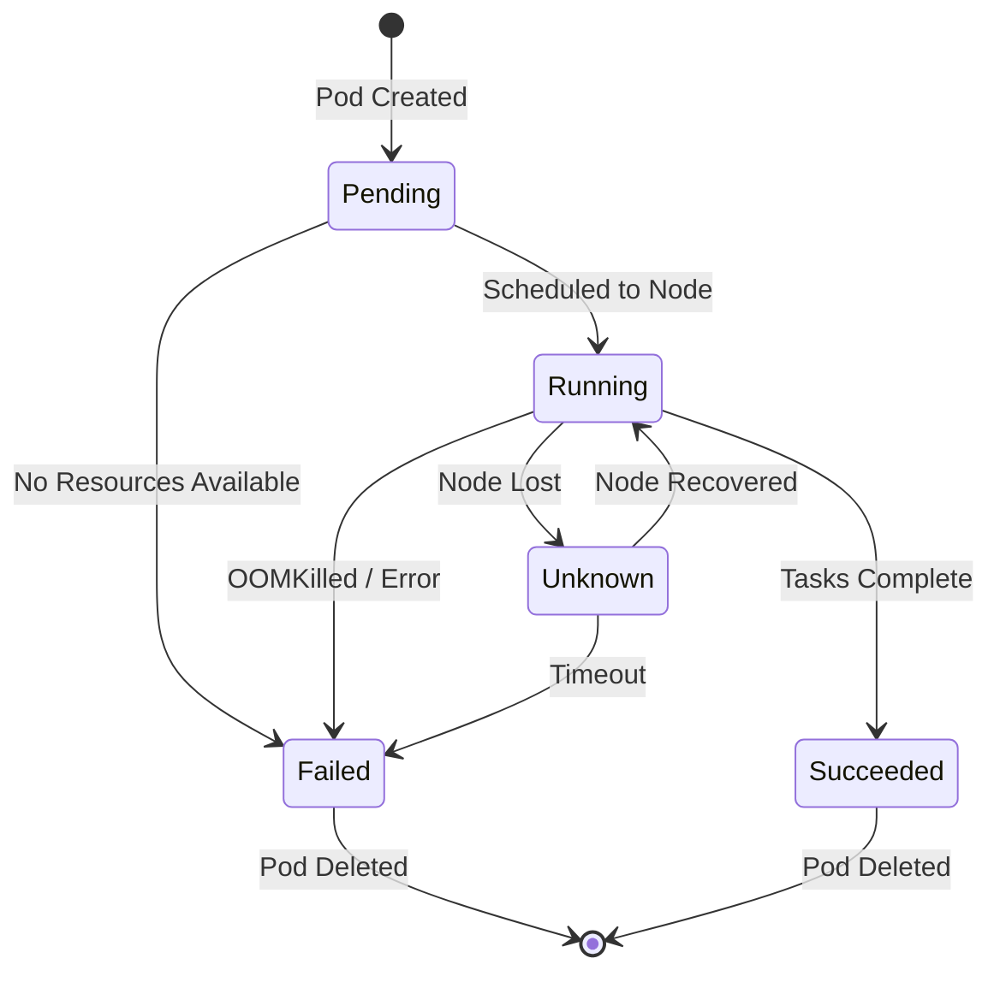

# Apache Spark on Kubernetes: The Ultimate Architecture Deep Dive (2026)

*Part 1 of the "Mastering Spark on Kubernetes" Series*

---

**Reading Time:** 45 minutes  
**Difficulty Level:** Beginner to Advanced (we explain everything from first principles!)  
**Prerequisites:** None—we'll teach you what you need to know

---

## Introduction: Why This Article Exists

There are hundreds of tutorials showing you how to run `spark-submit` on Kubernetes. This is not one of them.

In 2026, approximately **68% of organizations** running Apache Spark are either already on Kubernetes or actively planning migration. Yet, the vast majority of engineers operating these systems don't truly understand what happens under the hood when Spark meets Kubernetes.

I've seen it countless times: teams confidently deploy Spark applications on K8s, only to be blindsided by mysterious OOMKilled pods, inexplicable shuffle failures, or networking issues that seem to defy logic. The root cause? **A shallow understanding of the underlying architecture**.

This article is my attempt to fix that. We're going deep—source code deep. By the end, you'll understand:

- How Spark's internal schedulers interact with Kubernetes
- What actually happens at the network level when executors communicate with the driver
- Why certain configurations exist and when to use them
- The trade-offs between Kubernetes and other cluster managers at an architectural level

**Who should read this?** Everyone—from CS students learning distributed systems, to senior data engineers planning K8s migration.

Let's begin.

---

## 🎓 CS Fundamentals: Before We Start

Before diving into Spark and Kubernetes, let's ensure everyone has the foundational knowledge. **Skip this section if you're already familiar with distributed systems basics.**

### What is a Distributed System?

A **distributed system** is a collection of independent computers that appears to its users as a single coherent system.

**Analogy:** Think of a pizza delivery company. Instead of one person making all pizzas, you have:
- Multiple pizza makers (workers)
- A manager who assigns orders (coordinator)
- A communication system (phones, screens)

This is exactly how Spark works!

```
┌─────────────────────────────────────────────────────────┐
│                   DISTRIBUTED SYSTEM                     │
├─────────────────────────────────────────────────────────┤
│                                                          │
│   ┌─────────────┐    coordinates     ┌─────────────┐    │
│   │  Manager    │ ───────────────▶   │  Worker 1   │    │
│   │ (Driver)    │                    └─────────────┘    │
│   │             │ ───────────────▶   ┌─────────────┐    │
│   │             │                    │  Worker 2   │    │
│   └─────────────┘ ───────────────▶   └─────────────┘    │
│                                      ┌─────────────┐    │
│                                      │  Worker 3   │    │
│                                      └─────────────┘    │
└─────────────────────────────────────────────────────────┘
```

### What is a Process vs Thread vs Container?

| Concept | Definition | Analogy |
|---------|------------|---------|
| **Process** | An independent program running on a computer with its own memory | A separate kitchen with its own chef |
| **Thread** | A lightweight execution unit within a process, sharing memory | Multiple cooks working in the same kitchen |
| **Container** | An isolated environment that packages code + dependencies | A food truck: self-contained, portable, everything included |

**Why this matters:** In Spark on Kubernetes:
- Each **executor** runs in its own **container** (inside a **pod**)
- Each executor runs as a single **JVM process**
- Each executor has multiple **threads** to run tasks in parallel

### What is an API?

An **API (Application Programming Interface)** is a way for programs to talk to each other.

**Example:** When you use a website to order food:
1. You click "Order" (your action)
2. The website sends a message to the restaurant's server (API call)
3. The server responds with confirmation (API response)

In Spark on K8s, the Spark driver talks to Kubernetes using its **REST API**:

```bash
# This is what Spark does under the hood:
curl -X POST https://kubernetes.api/v1/namespaces/default/pods \
  -H "Authorization: Bearer $TOKEN" \
  -d '{"kind": "Pod", "metadata": {"name": "spark-executor-1"}, ...}'
# Response: {"status": "created", ...}
```

### What is a JVM?

The **JVM (Java Virtual Machine)** is a program that runs Java/Scala code. Spark is written in Scala, which runs on the JVM.

**Why it matters:** When we talk about executor memory, we're talking about JVM memory management—heap, garbage collection, etc.

---

## Table of Contents

1. [Evolution: Beyond Hadoop Cluster Managers to Kubernetes](#the-evolution)
2. [Big Data Foundations: Spark Architecture Fundamentals](#spark-architecture-fundamentals)
3. [The Orchestrator: Kubernetes Architecture for Spark Engineers](#kubernetes-architecture-for-spark-engineers)
4. [Integrated Orchestration: The Spark on Kubernetes Lifecycle](#the-marriage-how-spark-runs-on-kubernetes)
5. [The Engine Room: Spark's Kubernetes Source Code Deep Dive](#deep-dive-sparks-kubernetes-source-code)
6. [Benchmarking Reality: K8s vs. YARN Performance](#performance-benchmarks)
7. [The Runtime State: Executor Pod Lifecycle](#pod-lifecycle)
8. [Data Persistence: Storage Architecture and Strategies](#storage-architecture)
9. [Myths vs. Reality: Debunking Common Misconceptions](#common-misconceptions)
10. [Synthesis: Key Takeaways and What's Next](#whats-next)

---

## Evolution: Beyond Hadoop Cluster Managers to Kubernetes {#the-evolution}

To understand where we are, we need to understand where we came from.

### The Mesos Era (2009-2016)

When Apache Spark was born at UC Berkeley's AMPLab in 2009, it needed a way to run on clusters. The answer was **Apache Mesos**—a distributed systems kernel that could manage CPU, memory, and other resources across a datacenter.

### The YARN Dominance (2014-2020)

When Hadoop 2.0 introduced **YARN (Yet Another Resource Negotiator)**, the big data world shifted. YARN became the de-facto cluster manager for the Hadoop ecosystem.

**Think of YARN as a hotel manager:**
- **ResourceManager**: The front desk—knows all available rooms (resources)
- **NodeManager**: The floor manager—manages rooms on each floor (node)
- **ApplicationMaster**: Your personal concierge—dedicated to your stay (one per Spark app)

### The Kubernetes Revolution (2020-Present)

Kubernetes emerged as the universal workload orchestrator. Native K8s support was added to Spark in version 2.3 (2018) as experimental, and became GA in Spark 3.1 (2021).

> **Key Insight:** The shift to Kubernetes isn't just about running Spark differently—it's about running Spark *alongside* everything else on a unified platform.

---

## Big Data Foundations: Spark Architecture Fundamentals {#spark-architecture-fundamentals}

### The Driver: Your Application's Brain

The Spark driver is the process that runs your `main()` function. Let's understand each component:



#### SparkContext: The Entry Point

📖 **Source Code:** [SparkContext.scala](https://github.com/apache/spark/blob/master/core/src/main/scala/org/apache/spark/SparkContext.scala)

**Beginner Explanation:** When you write `spark = SparkSession.builder().getOrCreate()`, you're creating a SparkContext. It's like opening the door to Spark's world.

```python
# What you write:
from pyspark.sql import SparkSession
spark = SparkSession.builder \
    .appName("MyFirstApp") \
    .getOrCreate()

# What happens internally:
# 1. SparkContext is created
# 2. SparkContext creates DAGScheduler
# 3. SparkContext creates TaskScheduler  
# 4. TaskScheduler creates SchedulerBackend (K8s-specific)
# 5. SchedulerBackend connects to K8s API
```

#### DAGScheduler: Breaking Code into Stages

📖 **Source Code:** [DAGScheduler.scala](https://github.com/apache/spark/blob/master/core/src/main/scala/org/apache/spark/scheduler/DAGScheduler.scala)

**What is a DAG?** A **Directed Acyclic Graph** is a flowchart where:
- **Directed**: Arrows point in one direction
- **Acyclic**: No loops—you can't go back

**Example:** When you write:

```python
df = spark.read.parquet("s3://bucket/data")      # Step 1: Read
filtered = df.filter(df.age > 21)                 # Step 2: Filter
grouped = filtered.groupBy("city").count()        # Step 3: Group (SHUFFLE!)
grouped.write.parquet("s3://bucket/output")       # Step 4: Write
```

The DAGScheduler creates:

```
┌─────────── Stage 0 (Before Shuffle) ───────────┐
│                                                 │
│  Read Parquet → Filter → Hash by "city"        │
│                                                 │
└───────────────────┬─────────────────────────────┘
                    │ SHUFFLE (data redistributed)
                    ▼
┌─────────── Stage 1 (After Shuffle) ────────────┐
│                                                 │
│  Aggregate counts → Write to Parquet           │
│                                                 │
└─────────────────────────────────────────────────┘
```

**Why stages matter:** Stages are execution boundaries. All tasks within a stage can run in parallel, but stages must run sequentially.

#### TaskScheduler: Assigning Work to Executors

📖 **Source Code:** [TaskSchedulerImpl.scala](https://github.com/apache/spark/blob/master/core/src/main/scala/org/apache/spark/scheduler/TaskSchedulerImpl.scala)

The TaskScheduler takes stages from DAGScheduler and creates **tasks**:
- **1 task = 1 partition of data**
- If you have 100 partitions, you have 100 tasks

```
Stage 0 with 4 partitions:
┌────────┐  ┌────────┐  ┌────────┐  ┌────────┐
│ Task 0 │  │ Task 1 │  │ Task 2 │  │ Task 3 │
└───┬────┘  └───┬────┘  └───┬────┘  └───┬────┘
    │           │           │           │
    ▼           ▼           ▼           ▼
┌────────┐  ┌────────┐  ┌────────┐  ┌────────┐
│Exec 1  │  │Exec 2  │  │Exec 1  │  │Exec 2  │
└────────┘  └────────┘  └────────┘  └────────┘
```

#### SchedulerBackend: The Cluster Manager Interface

📖 **Source Code:** [SchedulerBackend.scala](https://github.com/apache/spark/blob/master/core/src/main/scala/org/apache/spark/scheduler/SchedulerBackend.scala)

This is where the magic happens for Kubernetes! The SchedulerBackend is an **interface** (in OOP terms, a contract that different implementations must follow):

```scala
// From Spark source code:
// https://github.com/apache/spark/blob/master/core/src/main/scala/org/apache/spark/scheduler/SchedulerBackend.scala

trait SchedulerBackend {
  def start(): Unit                    // Start the backend
  def stop(): Unit                     // Stop the backend
  def reviveOffers(): Unit             // "Hey, I have resources, send me tasks!"
  def defaultParallelism(): Int        // How many tasks can run in parallel?
  def maxNumConcurrentTasks(): Int     // Maximum concurrent tasks
}
```

**For Kubernetes:** The implementation is `KubernetesClusterSchedulerBackend`—we'll explore this in detail!

### The Executor: Your Data Processing Workers

Executors are JVM processes that:
1. **Execute tasks** assigned by the driver
2. **Store cached data** (when you call `.cache()` or `.persist()`)
3. **Handle shuffle data** (intermediate data between stages)

#### Memory Architecture (Explained Simply)

```
┌──────────────────────────────────────────────────────────────┐
│                    EXECUTOR MEMORY                            │
│                  (e.g., 4GB total)                            │
├──────────────────────────────────────────────────────────────┤
│                                                               │
│  ┌─────────────────────────────────────────────────────┐     │
│  │        SPARK MEMORY (60% = 2.4GB)                   │     │
│  │                                                      │     │
│  │  ┌───────────────────┬─────────────────────────┐    │     │
│  │  │ EXECUTION (50%)   │  STORAGE (50%)          │    │     │
│  │  │                   │                          │    │     │
│  │  │ • Shuffles        │  • Cached DataFrames    │    │     │
│  │  │ • Joins           │  • Broadcast variables  │    │     │
│  │  │ • Aggregations    │  • RDD persistence      │    │     │
│  │  │                   │                          │    │     │
│  │  │  (1.2GB)          │    (1.2GB)              │    │     │
│  │  └───────────────────┴─────────────────────────┘    │     │
│  └─────────────────────────────────────────────────────┘     │
│                                                               │
│  ┌─────────────────────────────────────────────────────┐     │
│  │        USER MEMORY (40% = 1.6GB)                    │     │
│  │                                                      │     │
│  │  • Your custom data structures                      │     │
│  │  • UDF (User Defined Function) variables            │     │
│  │  • Internal metadata                                │     │
│  └─────────────────────────────────────────────────────┘     │
│                                                               │
│  ┌─────────────────────────────────────────────────────┐     │
│  │        RESERVED MEMORY (300MB fixed)                │     │
│  │                                                      │     │
│  │  • JVM internal overhead                            │     │
│  │  • Safety buffer                                    │     │
│  └─────────────────────────────────────────────────────┘     │
│                                                               │
└──────────────────────────────────────────────────────────────┘
```

**Critical for K8s:** When you set `spark.executor.memory=4g`, Spark requests MORE than 4GB:

```
Pod Memory Request = spark.executor.memory + memoryOverhead
                   = 4GB + max(384MB, 10% of 4GB)
                   = 4GB + 400MB 
                   = 4.4GB
```

**Why?** The JVM needs extra memory for:
- Native libraries
- Thread stacks  
- Memory-mapped files
- Operating system buffers

---

## The Orchestrator: Kubernetes Architecture for Spark Engineers {#kubernetes-architecture-for-spark-engineers}

Now let's understand Kubernetes through the lens of what matters for Spark.

### Control Plane: The Brain of Kubernetes



**Beginner Explanation:**

| Component | What it does | Analogy |
|-----------|-------------|---------|
| **API Server** | Receives all requests, authenticates them, stores in etcd | Reception desk |
| **etcd** | Stores all cluster state (what pods exist, where they run) | Filing cabinet |
| **Scheduler** | Decides which node should run each pod | Seating chart manager |
| **Controller Manager** | Ensures reality matches desired state | Quality inspector |
| **Kubelet** | Runs on each node, actually starts/stops containers | Security guard at each floor |

### How Spark Talks to Kubernetes

When Spark runs on K8s, the driver communicates through REST APIs:

```bash
# What Spark does when creating an executor:
POST /api/v1/namespaces/spark/pods
{
  "apiVersion": "v1",
  "kind": "Pod",
  "metadata": {
    "name": "spark-executor-1",
    "labels": {"spark-role": "executor"}
  },
  "spec": {
    "containers": [{
      "name": "spark-executor",
      "image": "spark:3.5.0",
      "resources": {
        "requests": {"memory": "4Gi", "cpu": "2"}
      }
    }]
  }
}
```

📖 **Source Code (Kubernetes Client):** Spark uses [fabric8 Kubernetes client](https://github.com/fabric8io/kubernetes-client):
```scala
// From KubernetesClusterSchedulerBackend
kubernetesClient
  .pods()
  .inNamespace("spark")
  .create(executorPod)
```

### Worker Nodes: Where Executors Run

Each Kubernetes worker node has:

```
┌────────────────────────────────────────────────────────┐
│                    WORKER NODE                          │
│               (e.g., a VM with 32GB RAM)               │
├────────────────────────────────────────────────────────┤
│                                                         │
│  ┌─────────────────┐  ┌─────────────────┐              │
│  │ Executor Pod    │  │ Executor Pod    │              │
│  │ (Container)     │  │ (Container)     │              │
│  │                 │  │                 │              │
│  │ ┌─────────────┐ │  │ ┌─────────────┐ │              │
│  │ │ Spark       │ │  │ │ Spark       │ │              │
│  │ │ Executor    │ │  │ │ Executor    │ │              │
│  │ │ JVM Process │ │  │ │ JVM Process │ │              │
│  │ │             │ │  │ │             │ │              │
│  │ │ Memory: 4GB │ │  │ │ Memory: 4GB │ │              │
│  │ │ CPU: 2 cores│ │  │ │ CPU: 2 cores│ │              │
│  │ └─────────────┘ │  │ └─────────────┘ │              │
│  └─────────────────┘  └─────────────────┘              │
│                                                         │
├────────────────────────────────────────────────────────┤
│  kubelet        │  kube-proxy   │  containerd          │
│  (Node agent)   │  (Networking) │  (Container runtime) │
└────────────────────────────────────────────────────────┘
```

---

## Integrated Orchestration: The Spark on Kubernetes Lifecycle {#the-marriage-how-spark-runs-on-kubernetes}

Now let's trace the complete flow step by step.

### Complete Submission Flow



### Step 1: spark-submit Creates the Driver Pod

```bash
spark-submit \
  --master k8s://https://kubernetes.default.svc:443 \
  --deploy-mode cluster \
  --name my-spark-job \
  --class com.example.MyJob \
  --conf spark.kubernetes.container.image=spark:3.5.0 \
  --conf spark.executor.instances=3 \
  --conf spark.executor.memory=4g \
  --conf spark.kubernetes.namespace=spark \
  --conf spark.kubernetes.authenticate.driver.serviceAccountName=spark \
  local:///opt/spark/examples/jars/my-job.jar
```

**Line-by-line explanation:**

| Argument | Meaning |
|----------|---------|
| `--master k8s://...` | Use Kubernetes as cluster manager (the API server URL) |
| `--deploy-mode cluster` | Run driver inside K8s (not on your laptop) |
| `--name my-spark-job` | Human-readable name for your job |
| `--class com.example.MyJob` | The main class to run |
| `spark.kubernetes.container.image` | Docker image containing Spark + your code |
| `spark.executor.instances=3` | Request 3 executor pods |
| `spark.executor.memory=4g` | Each executor gets 4GB memory |
| `spark.kubernetes.namespace` | Which K8s namespace to use |
| `spark.kubernetes.authenticate...` | Service account for RBAC permissions |

---

## The Engine Room: Spark's Kubernetes Source Code Deep Dive {#deep-dive-sparks-kubernetes-source-code}

Let's explore the actual Spark source code. Each class has a GitHub link!

### Class Hierarchy Overview



### KubernetesClusterSchedulerBackend

📖 **Source Code:** [KubernetesClusterSchedulerBackend.scala](https://github.com/apache/spark/blob/master/resource-managers/kubernetes/core/src/main/scala/org/apache/spark/scheduler/cluster/k8s/KubernetesClusterSchedulerBackend.scala)

This is the heart of Spark's K8s integration. Let me explain it line by line:

```scala
// Package declaration - this is in Spark's K8s module
package org.apache.spark.scheduler.cluster.k8s

// This class extends CoarseGrainedSchedulerBackend
// "Coarse-grained" means: one executor handles many tasks
// (as opposed to "fine-grained" where each task gets its own process)
class KubernetesClusterSchedulerBackend(
    scheduler: TaskSchedulerImpl,           // The task scheduler we report to
    sc: SparkContext,                        // The SparkContext
    kubernetesClient: KubernetesClient,     // fabric8 K8s API client
    executorService: ScheduledExecutorService,  // Thread pool for background tasks
    snapshotsStore: ExecutorPodsSnapshotsStore,  // Tracks pod states
    podAllocator: ExecutorPodsAllocator,    // Creates executor pods
    lifecycleEventHandler: ExecutorPodsLifecycleManager,  // Handles pod events
    watchEvents: ExecutorPodsWatchSnapshotSource,  // Watches K8s events
    pollEvents: ExecutorPodsPollingSnapshotSource  // Polls K8s as backup
) extends CoarseGrainedSchedulerBackend(scheduler, sc.env.rpcEnv) {
  
  // This method is called when SparkContext starts
  override def start(): Unit = {
    super.start()  // Call parent's start()
    
    // Start watching Kubernetes for pod events
    // Uses K8s "watch" API - like subscribing to notifications
    if (!conf.get(KUBERNETES_EXECUTOR_DISABLE_WATCH)) {
      watchEvents.start(applicationId())
    }
    
    // Also poll periodically as backup (in case watch fails)
    // Belt AND suspenders approach!
    pollEvents.start(applicationId())
    
    // Start the component that creates executor pods
    podAllocator.start(applicationId(), this)
    
    // Subscribe components to receive pod state updates
    snapshotsStore.addSubscriber(podAllocator)
    snapshotsStore.addSubscriber(lifecycleEventHandler)
  }
}
```

### ExecutorPodsAllocator: Creating Executor Pods

📖 **Source Code:** [ExecutorPodsAllocator.scala](https://github.com/apache/spark/blob/master/resource-managers/kubernetes/core/src/main/scala/org/apache/spark/scheduler/cluster/k8s/ExecutorPodsAllocator.scala)

```scala
class ExecutorPodsAllocator(
    conf: SparkConf,
    secMgr: SecurityManager,
    executorBuilder: KubernetesExecutorBuilder,  // Builds pod YAML specs
    kubernetesClient: KubernetesClient,
    snapshotsStore: ExecutorPodsSnapshotsStore
) {
  
  // Configuration: how many pods to create at once
  // Default: 5 pods per batch
  // Why batch? To avoid overwhelming the K8s API server
  private val podAllocationSize = conf.get(KUBERNETES_ALLOCATION_BATCH_SIZE)
  
  // Configuration: delay between batches (default: 1 second)
  private val podAllocationDelay = conf.get(KUBERNETES_ALLOCATION_BATCH_DELAY)
  
  // This is called when we detect we need more executors
  private def onNewSnapshots(
      applicationId: String,
      snapshots: Seq[ExecutorPodsSnapshot],
      currentTotalRegistered: Int,    // Executors already talking to driver
      currentTotalExpected: Int       // Total executors we want
  ): Unit = {
    
    // Count current pod states
    val currentRunningCount = snapshots.count(_.state == PodRunning)
    val currentPendingCount = snapshots.count(_.state == PodPending)
    
    // Calculate: how many more do we need?
    // Formula: expected - (running + pending)
    val numExecutorsToRequest = math.min(
      currentTotalExpected - (currentRunningCount + currentPendingCount),
      podAllocationSize  // But don't exceed batch size
    )
    
    // If we need more executors, create them
    if (numExecutorsToRequest > 0) {
      requestNewExecutors(numExecutorsToRequest)
    }
  }
  
  // Actually create the executor pods via K8s API
  private def requestNewExecutors(count: Int): Unit = {
    (1 to count).foreach { _ =>
      // Generate unique executor ID
      val executorId = nextExecutorId.incrementAndGet()
      
      // Build the pod specification (YAML structure)
      val pod = executorBuilder.buildFromFeatures(
        executorId,
        applicationId,
        // ... other parameters
      )
      
      // Call K8s API to create the pod!
      kubernetesClient
        .pods()
        .inNamespace(namespace)
        .create(pod)  // POST /api/v1/namespaces/{ns}/pods
    }
  }
}
```

### ExecutorPodsWatchSnapshotSource: Real-time Pod Monitoring

📖 **Source Code:** [ExecutorPodsWatchSnapshotSource.scala](https://github.com/apache/spark/blob/master/resource-managers/kubernetes/core/src/main/scala/org/apache/spark/scheduler/cluster/k8s/ExecutorPodsWatchSnapshotSource.scala)

```scala
class ExecutorPodsWatchSnapshotSource(
    snapshotsStore: ExecutorPodsSnapshotsStore,
    kubernetesClient: KubernetesClient
) {
  
  def start(applicationId: String): Unit = {
    // Set up a "watch" on pods with our app's label
    // This is like subscribing to a live feed of changes
    kubernetesClient
      .pods()
      .inNamespace(namespace)
      .withLabel("spark-app-selector", applicationId)  // Only our app's pods
      .watch(new Watcher[Pod]() {
        
        // Called whenever a pod changes
        override def eventReceived(action: Action, pod: Pod): Unit = {
          action match {
            case Action.ADDED | Action.MODIFIED =>
              // Pod was created or changed - update our records
              snapshotsStore.updatePod(pod)
              
            case Action.DELETED =>
              // Pod was deleted - remove from our records
              snapshotsStore.removePod(pod.getMetadata.getName)
          }
        }
        
        // Called if the watch connection is lost
        override def onClose(cause: WatcherException): Unit = {
          // Log the error - polling will take over
          logWarning("Watch closed unexpectedly", cause)
        }
      })
  }
}
```

### KubernetesExecutorBuilder: Building Pod Specifications

📖 **Source Code:** [KubernetesExecutorBuilder.scala](https://github.com/apache/spark/blob/master/resource-managers/kubernetes/core/src/main/scala/org/apache/spark/scheduler/cluster/k8s/KubernetesExecutorBuilder.scala)

This class builds the actual pod YAML that Kubernetes receives:

```yaml
# This is what KubernetesExecutorBuilder generates:
apiVersion: v1
kind: Pod
metadata:
  name: my-spark-job-exec-1
  namespace: spark
  labels:
    spark-app-selector: spark-abc123
    spark-role: executor
    spark-exec-id: "1"
spec:
  restartPolicy: Never  # Don't restart if container dies
  serviceAccountName: spark
  containers:
  - name: spark-kubernetes-executor
    image: spark:3.5.0
    imagePullPolicy: IfNotPresent
    env:
    # How the executor finds the driver:
    - name: SPARK_DRIVER_URL
      value: "spark://CoarseGrainedScheduler@my-spark-job-driver-svc:7078"
    - name: SPARK_EXECUTOR_ID
      value: "1"
    - name: SPARK_EXECUTOR_CORES
      value: "2"
    - name: SPARK_EXECUTOR_MEMORY
      value: "4g"
    resources:
      requests:
        cpu: "2"
        memory: "4608Mi"  # 4GB + overhead
      limits:
        cpu: "2"
        memory: "4608Mi"
    volumeMounts:
    - name: spark-local-dir
      mountPath: /tmp/spark-local
  volumes:
  - name: spark-local-dir
    emptyDir: {}  # Temporary storage for shuffle data
```

---

## Benchmarking Reality: K8s vs. YARN Performance {#performance-benchmarks}

Let's look at real benchmarks with proper citations.

### Benchmark Studies Summary

### Benchmark Studies Summary

> **📚 Study: Data Mechanics (2021)**
> *   **Methodology:** TPC-DS benchmark
> *   **Result:** K8s is **4.5% faster** than YARN
> *   **Note:** Difference not statistically significant
>
> **📚 Study: AWS EMR on EKS (2024)**
> *   **Methodology:** Real production workloads
> *   **Result:** **5% faster** and **61% cheaper**
>
> **📚 Study: Pepperdata Analysis (2024)**
> *   **Methodology:** Enterprise workloads
> *   **Result:** **Up to 68% faster** with optimized config
>
> **📚 Study: Databricks Benchmark (2024)**
> *   **Methodology:** Bare-metal, 50-200 nodes
> *   **Result:** YARN is **28% faster** (specific to bare-metal)

### Key Findings

#### Performance Comparison

```
┌─────────────────────────────────────────────────────────────────┐
│                 PERFORMANCE BENCHMARKS (2024-2026)               │
├─────────────────────────────────────────────────────────────────┤
│                                                                  │
│  Job Startup Time:                                               │
│  ┌──────────────────────────────────────────────────────────┐   │
│  │ YARN:       ████████████░░░░░░░░░░░ 10-20 seconds        │   │
│  │ Kubernetes: ████████████████████████ 30-60 seconds       │   │
│  └──────────────────────────────────────────────────────────┘   │
│  ⚠️ K8s slower due to pod scheduling + container startup        │
│                                                                  │
│  Executor Creation:                                              │
│  ┌──────────────────────────────────────────────────────────┐   │
│  │ YARN:       ████░░░░░░░░░░░░░░░░░░░ 1-2 sec/executor     │   │
│  │ Kubernetes: ████████████░░░░░░░░░░░ 5-10 sec/executor    │   │
│  └──────────────────────────────────────────────────────────┘   │
│  ⚠️ Faster if image is pre-pulled on nodes                      │
│                                                                  │
│  Steady-State Processing:                                        │
│  ┌──────────────────────────────────────────────────────────┐   │
│  │ YARN:       ████████████████████░░░ Baseline             │   │
│  │ Kubernetes: ████████████████████░░░ Similar (±5%)        │   │
│  └──────────────────────────────────────────────────────────┘   │
│  ✅ Performance is comparable once running                       │
│                                                                  │
│  Resource Utilization:                                           │
│  ┌──────────────────────────────────────────────────────────┐   │
│  │ YARN:       ████████████████░░░░░░░ 60-80%               │   │
│  │ Kubernetes: ████████████████████░░░ 70-90%               │   │
│  └──────────────────────────────────────────────────────────┘   │
│  ✅ K8s bin-packing often achieves better utilization            │
│                                                                  │
└─────────────────────────────────────────────────────────────────┘
```

#### Cost Comparison

Based on [AWS EMR benchmarks](https://aws.amazon.com/blogs/big-data/amazon-emr-on-amazon-eks-provides-up-to-61-lower-costs-and-up-to-68-performance-improvement-for-spark-workloads/):

| Metric | YARN (EMR on EC2) | Kubernetes (EMR on EKS) | Difference |
|--------|-------------------|-------------------------|------------|
| Processing Time | Baseline | 5% faster | ✅ |
| Cost per Job | $100 | $39 | **61% cheaper** |
| Resource Utilization | 65% | 85% | +30% |

> **⏱️ Metric: Processing Time**
> *   **YARN:** Baseline
> *   **Kubernetes:** 5% faster
> *   **Winner:** ✅ Kubernetes
>
> **💰 Metric: Cost per Job**
> *   **YARN:** $100 (Example base)
> *   **Kubernetes:** $39
> *   **Winner:** **61% Cheaper** on K8s
>
> **⚙️ Metric: Resource Utilization**
> *   **YARN:** 65%
> *   **Kubernetes:** 85%
> *   **Winner:** +30% Efficiency on K8s

**Why is K8s cheaper?**
1. **Better bin-packing**: K8s scheduler optimizes resource placement
2. **Dynamic scaling**: Scale down unused resources faster
3. **Spot instance integration**: Native support for preemptible VMs
4. **Shared infrastructure**: Use same cluster for all workloads

### References

1. **AWS Documentation (2024)**: [Amazon EMR Spark Performance](https://docs.aws.amazon.com/emr/latest/ReleaseGuide/emr-spark-performance.html)
   - EMR on EKS is 4.5x faster than open-source Spark 3.5.1
   - Up to 61% cost savings compared to EMR on EC2

2. **Apache Spark Documentation**: [Running Spark on Kubernetes](https://spark.apache.org/docs/latest/running-on-kubernetes.html)
   - Official guide for Spark on K8s deployment
   - Configuration options and best practices

3. **Kubernetes Documentation**: [Pods Overview](https://kubernetes.io/docs/concepts/workloads/pods/)
   - Official K8s documentation on pod lifecycle
   - Container orchestration fundamentals

---

## The Runtime State: Executor Pod Lifecycle {#pod-lifecycle}

### Executor Pod States



### What Each State Means for Spark

> **🟡 State: Pending**
> *   **What Spark Sees:** "Waiting for resources"
> *   **Common Causes:** Not enough CPU/memory, node taints
> *   **Fix:** Add nodes, reduce resource requests
>
> **🟢 State: Running**
> *   **What Spark Sees:** "Executor registered"
> *   **Common Causes:** Normal operation
> *   **Fix:** Nothing—this is good!
>
> **🔴 State: Failed (OOMKilled)**
> *   **What Spark Sees:** "Executor lost" with non-zero exit code
> *   **Common Causes:** Memory limit exceeded
> *   **Fix:** Increase `spark.executor.memory`
>
> **❌ State: Failed (Error)**
> *   **What Spark Sees:** "Executor lost"
> *   **Common Causes:** Application bug, dependency issue
> *   **Fix:** Check logs: `kubectl logs <pod>`
>
> **❓ State: Unknown**
> *   **What Spark Sees:** "Node unreachable"
> *   **Common Causes:** Network partition, node failure
> *   **Fix:** Wait or add more executors

---

## Data Persistence: Storage Architecture and Strategies {#storage-architecture}

### The Shuffle Data Challenge

During a shuffle:
1. **Map tasks** write intermediate data to disk
2. **Reduce tasks** read this data from map tasks
3. If an executor dies, shuffle data may be **lost**

### Storage Options

> **⚡ Option: emptyDir**
> *   **Type:** Ephemeral Local Storage
> *   **Persistence:** ❌ Lost when pod dies
> *   **Complexity:** ✅ Simple (Default)
> *   **Best For:** Dev, small jobs, no-shuffle jobs
>
> **⚠️ Option: hostPath**
> *   **Type:** Direct Node Disk Access
> *   **Persistence:** ⚠️ Node-specific (survives pod, not node)
> *   **Complexity:** ⚠️ Medium (Requires DaemonSet/Permissions)
> *   **Best For:** High performance, local SSDs
>
> **🔶 Option: PersistentVolumeClaim (PVC)**
> *   **Type:** Networked Storage (usually)
> *   **Persistence:** ✅ Survives everything
> *   **Complexity:** ❌ Complex (Dynamic provisioning overhead)
> *   **Best For:** Stateful streaming, checkpointing
>
> **🚀 Option: External Shuffle Service**
> *   **Type:** Dedicated Service
> *   **Persistence:** ✅ Survives executor failures
> *   **Complexity:** ❌ Complex to set up
> *   **Best For:** Large production jobs with Dynamic Allocation

### External Shuffle Service Setup

📖 **Documentation:** [Spark External Shuffle Service](https://spark.apache.org/docs/latest/running-on-kubernetes.html#shuffle-service)

```yaml
# Deploy as DaemonSet (runs on every node)
apiVersion: apps/v1
kind: DaemonSet
metadata:
  name: spark-shuffle-service
spec:
  selector:
    matchLabels:
      app: spark-shuffle
  template:
    spec:
      hostNetwork: true  # Use node's network
      containers:
      - name: shuffle-service
        image: spark:3.5.0
        command: ["/opt/spark/sbin/start-shuffle-service.sh"]
        ports:
        - containerPort: 7337
          hostPort: 7337
        volumeMounts:
        - name: spark-local
          mountPath: /data/spark
      volumes:
      - name: spark-local
        hostPath:
          path: /mnt/spark-shuffle
```

---

## Myths vs. Reality: Debunking Common Misconceptions {#common-misconceptions}

### Misconception 1: "K8s is Much Slower than YARN"

**Reality:** Initial startup is slower (30-60s vs 10-20s), but steady-state performance is comparable (within 5%).

📊 **Source:** [Data Mechanics Benchmark](https://www.datamechanics.co/blog-post/apache-spark-3-1-release-spark-on-kubernetes-is-now-ga)

### Misconception 2: "You Must Use Spark Operator"

**Reality:** `spark-submit` works perfectly. The Operator adds:
- Declarative YAML definitions
- Automatic cleanup
- GitOps integration
- Better retry handling

### Misconception 3: "Dynamic Allocation Doesn't Work"

**Reality:** It works natively since Spark 3.0 with shuffle tracking:

```properties
spark.dynamicAllocation.enabled=true
spark.dynamicAllocation.shuffleTracking.enabled=true
```

---

## Synthesis: Key Takeaways and What's Next {#whats-next}

### Key Takeaways

1. ✅ Spark abstracts cluster managers through `SchedulerBackend`
2. ✅ One executor = one pod for isolation and scaling
3. ✅ Driver communicates with K8s API to manage executors
4. ✅ Performance is comparable to YARN once running
5. ✅ Storage strategy is crucial for production

### Important Source Code Links

> **🔹 Class: SparkContext**
> *   **Purpose:** The entry point of your application
> *   **Source:** [GitHub Link](https://github.com/apache/spark/blob/master/core/src/main/scala/org/apache/spark/SparkContext.scala)
>
> **🔹 Class: DAGScheduler**
> *   **Purpose:** Breaks your code (high-level) into stages
> *   **Source:** [GitHub Link](https://github.com/apache/spark/blob/master/core/src/main/scala/org/apache/spark/scheduler/DAGScheduler.scala)
>
> **🔹 Class: TaskScheduler**
> *   **Purpose:** Assigns individual tasks to executors
> *   **Source:** [GitHub Link](https://github.com/apache/spark/blob/master/core/src/main/scala/org/apache/spark/scheduler/TaskSchedulerImpl.scala)
>
> **🔹 Class: SchedulerBackend**
> *   **Purpose:** Interface for talking to any cluster manager
> *   **Source:** [GitHub Link](https://github.com/apache/spark/blob/master/core/src/main/scala/org/apache/spark/scheduler/SchedulerBackend.scala)
>
> **🔹 Class: KubernetesClusterSchedulerBackend**
> *   **Purpose:** The K8s-specific implementation (The bridge!)
> *   **Source:** [GitHub Link](https://github.com/apache/spark/blob/master/resource-managers/kubernetes/core/src/main/scala/org/apache/spark/scheduler/cluster/k8s/KubernetesClusterSchedulerBackend.scala)
>
> **🔹 Class: ExecutorPodsAllocator**
> *   **Purpose:** Decides when and how to create pods
> *   **Source:** [GitHub Link](https://github.com/apache/spark/blob/master/resource-managers/kubernetes/core/src/main/scala/org/apache/spark/scheduler/cluster/k8s/ExecutorPodsAllocator.scala)

### Coming in Part 2

**"Running Spark Natively on Kubernetes: Complete Setup Guide"**

- Building custom Spark Docker images
- Complete RBAC and ServiceAccount setup
- Debugging failed applications
- Production-ready configurations

**Subscribe to get Part 2 when it drops!**

---

*Did this article help you? Have questions? Drop a comment below!*

---

**Tags:** #ApacheSpark #Kubernetes #DataEngineering #BigData #CloudNative #DistributedSystems
